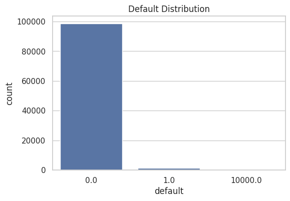
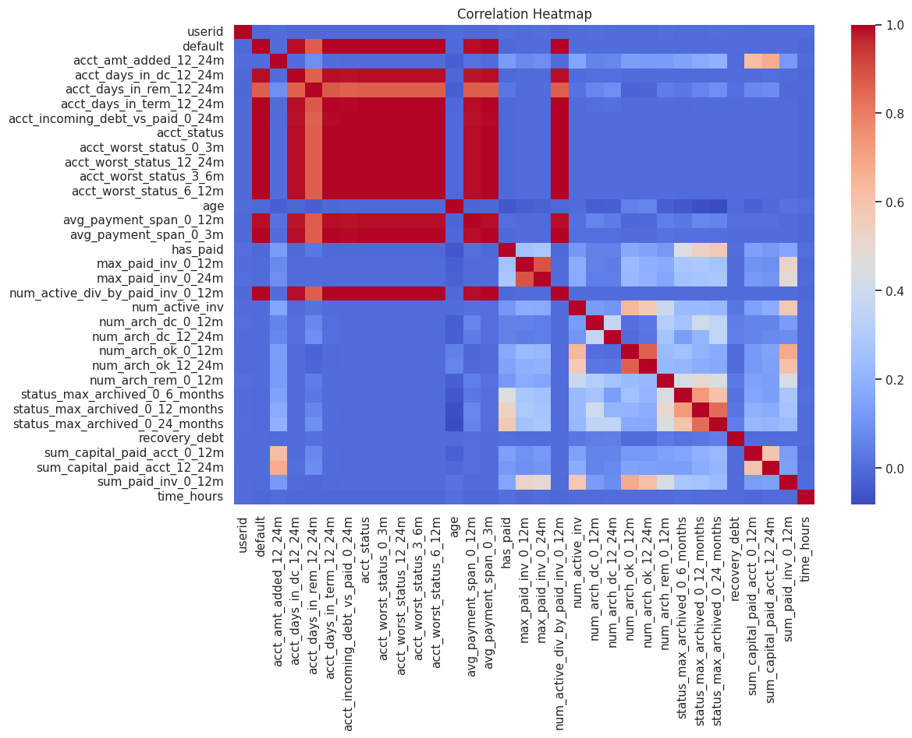
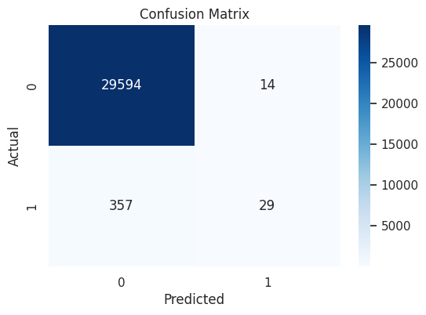
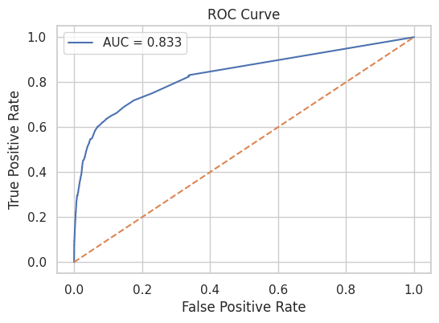
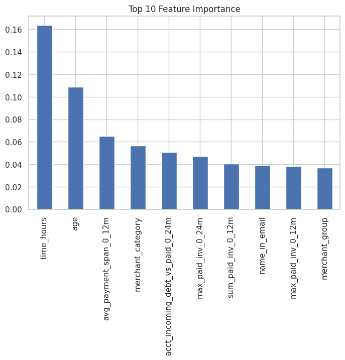

# Credit Risk Prediction using Machine Learning
Overview

This project develops machine learning models to predict credit default risk using customer financial behavior and repayment history.

The objective is to help financial institutions identify high-risk borrowers early, reduce credit losses, and improve credit approval decisions.

Using historical loan and repayment data, multiple machine learning models were trained and evaluated to identify the most accurate predictive approach.

# Dataset

The dataset contains financial behavior variables related to credit usage and repayment patterns, including:

Repayment history

Credit account status

Debt recovery indicators

Merchant category activity

Payment span behavior

Account balances and transaction activity

Sample dataset included in this repository:

PD_modelling_dataset.xlsx
# Project Workflow

The project follows a standard machine learning pipeline:

Data Cleaning and Preprocessing

Feature Engineering

Exploratory Data Analysis (EDA)

Model Training

Model Evaluation

Feature Importance Analysis

Machine Learning Models Used

# The following models were trained and compared:

Logistic Regression

Decision Tree

Random Forest

Gradient Boosting

AdaBoost

Random Forest provided the best predictive performance.

## Exploratory Data Analysis

EDA helped identify relationships between repayment behavior and default risk.

# Model Evaluation Results

Random Forest produced the best results.

Performance metrics:

ROC-AUC Score: 0.833

True Negatives: 29,594

False Positives: 14

False Negatives: 357

True Positives: 29

The model demonstrates strong ability to distinguish between default and non-default borrowers.

# Key Predictive Features

The most important features influencing credit default prediction were:

Time since last financial activity

Customer age

Average payment span

Merchant category behavior

Incoming debt vs paid ratio

Invoice payment history

These variables provide strong signals for predicting borrower risk.
